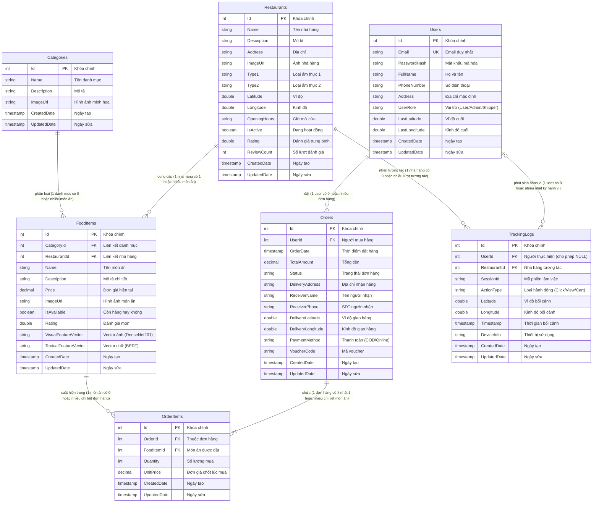
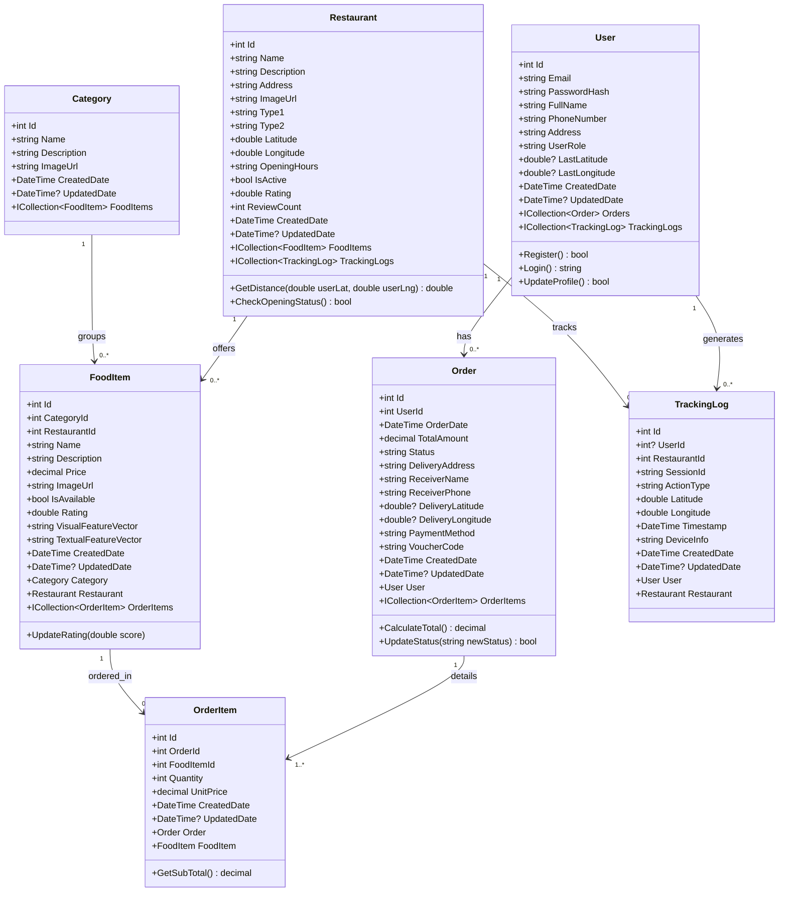
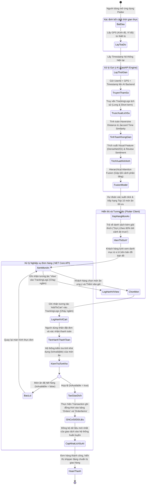

# 📋 BÁO CÁO PHÂN TÍCH & THIẾT KẾ HỆ THỐNG CƠ SỞ DỮ LIỆU
## ĐỀ TÀI: HỆ THỐNG GỢI Ý MÓN ĂN ĐA PHƯƠNG THỨC BỐI CẢNH (M-CARS-FOOD)

Tài liệu này được thiết kế và chuẩn hóa nhằm đáp ứng chính xác các yêu cầu kiểm tra và hiệu chỉnh của **thầy hướng dẫn (thầy Yếu)** về phân tích thiết kế hệ thống, phân loại thực thể, biểu đồ thực thể mối quan hệ (ERD) kèm bản số, biểu đồ lớp (Class Diagram) và biểu đồ hoạt động (Activity Diagram - AD).

---

## 1. PHÂN LOẠI 3 LOẠI THỰC THỂ & THUỘC TÍNH CHI TIẾT
Theo yêu cầu phân tách luận lý cấu trúc dữ liệu, các thực thể trong hệ thống **M-CARS-Food** được chia thành 3 nhóm rõ rệt:

### 1.1. Thực thể cơ bản (Core / Basic Entities)
> *Là tài nguyên gốc của hệ thống, mang tính chất thông tin tĩnh hoặc bán tĩnh, ít biến động theo thời gian vận hành và là nền tảng tham chiếu cho mọi hoạt động khác.*

1. **Danh mục (Categories)**: Phân loại các món ăn trong hệ thống.
   * **Thuộc tính:**
     * <u>Id</u> (Khóa chính - PK, kiểu dữ liệu: `int`)
     * Name (Tên danh mục - `string`)
     * Description (Mô tả chi tiết - `string`)
     * ImageUrl (Đường dẫn ảnh đại diện - `string`)
     * CreatedDate (Thời gian tạo - `datetime`)
     * UpdatedDate (Thời gian cập nhật - `datetime`)

2. **Nhà hàng (Restaurants)**: Các cửa hàng ẩm thực liên kết trong hệ thống phục vụ định vị địa lý.
   * **Thuộc tính:**
     * <u>Id</u> (Khóa chính - PK, kiểu dữ liệu: `int`)
     * Name (Tên nhà hàng - `string`)
     * Description (Mô tả nhà hàng - `string`)
     * Address (Địa chỉ vật lý - `string`)
     * ImageUrl (Ảnh đại diện nhà hàng - `string`)
     * Type1 (Phân loại ẩm thực chính - `string`)
     * Type2 (Phân loại ẩm thực phụ - `string`)
     * Latitude (Vĩ độ định vị - `double`)
     * Longitude (Kinh độ định vị - `double`)
     * OpeningHours (Giờ mở/đóng cửa - `string`)
     * IsActive (Trạng thái hoạt động - `boolean`)
     * Rating (Điểm đánh giá trung bình - `double`)
     * ReviewCount (Số lượng đánh giá - `int`)
     * CreatedDate (Thời gian tạo - `datetime`)
     * UpdatedDate (Thời gian cập nhật - `datetime`)

3. **Món ăn (FoodItems)**: Thực đơn chi tiết của các nhà hàng, tích hợp các vector đặc trưng phục vụ AI.
   * **Thuộc tính:**
     * <u>Id</u> (Khóa chính - PK, kiểu dữ liệu: `int`)
     * Name (Tên món ăn - `string`)
     * Description (Mô tả món ăn - `string`)
     * Price (Đơn giá hiện hành - `decimal`)
     * ImageUrl (Đường dẫn hình ảnh món ăn - `string`)
     * IsAvailable (Trạng thái còn/hết hàng - `boolean`)
     * CategoryId (Khóa ngoại tham chiếu danh mục - FK, `int`)
     * RestaurantId (Khóa ngoại tham chiếu nhà hàng - FK, `int`)
     * Rating (Điểm đánh giá trung bình của món ăn - `double`)
     * VisualFeatureVector (Vector đặc trưng thị giác trích xuất từ **DenseNet201** - `text`)
     * TextualFeatureVector (Vector đặc trưng văn bản trích xuất từ **BERT/RoBERTa** - `text`)
     * CreatedDate (Thời gian tạo - `datetime`)
     * UpdatedDate (Thời gian cập nhật - `datetime`)

---

### 1.2. Thực thể đối tượng ngoài (External / Actor Entities)
> *Đại diện cho con người, tổ chức hoặc các tác nhân chủ động tương tác, vận hành và sử dụng tài nguyên của hệ thống.*

1. **Người dùng (Users)**: Bao gồm cả Khách hàng (User), Quản trị viên (Admin), và Người giao hàng (Shipper).
   * **Thuộc tính:**
     * <u>Id</u> (Khóa chính - PK, kiểu dữ liệu: `int`)
     * Email (Email đăng nhập - Duy nhất/Unique, `string`)
     * PasswordHash (Mật khẩu đã mã hóa BCrypt - `string`)
     * FullName (Họ và tên - `string`)
     * PhoneNumber (Số điện thoại liên lạc - `string`)
     * Address (Địa chỉ mặc định - `string`)
     * UserRole (Vai trò hệ thống: 'User', 'Admin', 'Shipper' - `string`)
     * LastLatitude (Vĩ độ định vị gần nhất của thiết bị - `double`)
     * LastLongitude (Kinh độ định vị gần nhất của thiết bị - `double`)
     * CreatedDate (Thời gian đăng ký tài khoản - `datetime`)
     * UpdatedDate (Thời gian cập nhật thông tin - `datetime`)

---

### 1.3. Thực thể nghiệp vụ (Transactional / Business Entities)
> *Là những thực thể khó nhận diện nhất nhưng đóng vai trò cốt lõi. Chúng sinh ra liên tục theo dòng thời gian khi hệ thống đi vào vận hành thực tế (giao dịch, hành vi, lịch sử).*

1. **Đơn hàng (Orders)**: Lưu vết giao dịch mua sắm đồ ăn của người dùng tại một thời điểm cụ thể.
   * **Thuộc tính:**
     * <u>Id</u> (Khóa chính - PK, kiểu dữ liệu: `int`)
     * UserId (Khóa ngoại tham chiếu người dùng đặt hàng - FK, `int`)
     * OrderDate (Thời điểm phát sinh đơn hàng - **Yếu tố thời gian**, `datetime`)
     * TotalAmount (Tổng giá trị đơn hàng - `decimal`)
     * Status (Trạng thái đơn hàng: 'Pending', 'Confirmed', 'Preparing', 'Delivering', 'Completed', 'Cancelled' - `string`)
     * DeliveryAddress (Địa chỉ giao hàng thực tế - `string`)
     * ReceiverName (Tên người nhận - `string`)
     * ReceiverPhone (Số điện thoại người nhận - `string`)
     * DeliveryLatitude (Vĩ độ địa điểm giao hàng thực tế - `double`)
     * DeliveryLongitude (Kinh độ địa điểm giao hàng thực tế - `double`)
     * PaymentMethod (Phương thức thanh toán: COD, Ví điện tử... - `string`)
     * VoucherCode (Mã giảm giá áp dụng nếu có - `string`)
     * CreatedDate (Thời gian tạo bản ghi đơn hàng - `datetime`)
     * UpdatedDate (Thời gian cập nhật trạng thái đơn - `datetime`)

2. **Chi tiết đơn hàng (OrderItems)**: Lưu thông tin chi tiết từng món ăn trong một đơn hàng. Đây là thực thể nghiệp vụ bắt buộc để cố định giá và số lượng tại thời điểm phát sinh giao dịch (tránh biến động khi giá món ăn ở danh mục cơ bản thay đổi).
   * **Thuộc tính:**
     * <u>Id</u> (Khóa chính - PK, kiểu dữ liệu: `int`)
     * OrderId (Khóa ngoại liên kết đơn hàng - FK, `int`)
     * FoodItemId (Khóa ngoại liên kết món ăn - FK, `int`)
     * Quantity (Số lượng đặt mua - **Phát sinh theo giao dịch**, `int`)
     * UnitPrice (Đơn giá thực tế tại thời điểm mua - `decimal`)
     * CreatedDate (Thời gian tạo - `datetime`)
     * UpdatedDate (Thời gian cập nhật - `datetime`)

3. **Nhật ký hành vi & Bối cảnh (TrackingLogs)**: Ghi nhận vết tương tác thời gian thực của người dùng (nhấp chuột, xem món, thêm giỏ hàng) phục vụ huấn luyện và dự đoán của mô hình AI gợi ý tuần tự bối cảnh (SCR).
   * **Thuộc tính:**
     * <u>Id</u> (Khóa chính - PK, kiểu dữ liệu: `int`)
     * UserId (Khóa ngoại liên kết người dùng tương tác - FK, `int`)
     * RestaurantId (Khóa ngoại liên kết nhà hàng được tương tác - FK, `int`)
     * SessionId (Mã phiên tương tác - `string`)
     * ActionType (Loại hành vi nghiệp vụ: 'View', 'AddToCart', 'Click' - `string`)
     * Latitude (Vĩ độ định vị bối cảnh lúc hành động - **Yếu tố không gian**, `double`)
     * Longitude (Kinh độ định vị bối cảnh lúc hành động - **Yếu tố không gian**, `double`)
     * Timestamp (Thời điểm phát sinh hành vi - **Yếu tố thời gian cốt lõi**, `datetime`)
     * DeviceInfo (Thông tin thiết bị di động sử dụng - `string`)
     * CreatedDate (Thời gian ghi nhận vào hệ thống - `datetime`)
     * UpdatedDate (Thời gian cập nhật - `datetime`)

---

## 2. BIỂU ĐỒ THỰC THỂ MỐI QUAN HỆ (ERD - ENTITY RELATIONSHIP DIAGRAM)
Dưới đây là mô hình ERD thể hiện đầy đủ các thuộc tính, khóa chính (PK), khóa ngoại (FK) cùng các **cặp bản số (Cardinality)** chuẩn mực:
* **`||--o{`**: Quan hệ 1 - Nhiều (1 bên bắt buộc là 1, 1 bên có thể từ 0 đến nhiều)
* **`||--|{`**: Quan hệ 1 - Nhiều (1 bên bắt buộc là 1, 1 bên bắt buộc từ 1 đến nhiều)
* **`o|--o{`**: Quan hệ 0 hoặc 1 - Nhiều (cho phép khóa ngoại NULL)

---

## 3. BIỂU ĐỒ LỚP CHI TIẾT (CLASS DIAGRAM)
Biểu đồ lớp dưới đây được thiết kế theo mô hình lập trình hướng đối tượng (OOP), tương ứng trực tiếp với cấu trúc Entity Framework Core (EF Core) ở Backend và Dart Classes ở Frontend:

---

## 4. BIỂU ĐỒ HOẠT ĐỘNG (ACTIVITY DIAGRAM - AD)
Biểu đồ hoạt động mô phỏng **Luồng nghiệp vụ Đặt món ăn trực tuyến tích hợp Gợi ý bối cảnh đa phương thức (M-CARS-Food)**, thể hiện rõ sự tương tác nhịp nhàng giữa Thiết bị di động (Flutter), Hệ thống Backend Core (.NET Core C# API) và Trình gợi ý AI (FastAPI Engine):

---

## 5. ĐÁNH GIÁ & ĐỐI CHIẾU HỆ THỐNG SAU KHI CẢI TIẾN
Nhờ sự phân loại và cấu trúc nghiêm ngặt này của **thầy hướng dẫn (thầy Yếu)**, hệ thống đạt được các ưu điểm học thuật lớn:
1. **Rõ ràng về mặt kiến trúc:** Giúp người đọc báo cáo phân biệt được đâu là dữ liệu nền tảng tĩnh (`Categories`, `Restaurants`), dữ liệu tương tác con người (`Users`), và dữ liệu vận hành giao dịch động (`Orders`, `OrderItems`, `TrackingLogs`).
2. **Khắc phục triệt để bài toán thời gian thực:** Bảng nghiệp vụ `TrackingLogs` chính là chìa khóa vàng ghi nhận biến động hành vi theo chuỗi thời gian thực tế để cung cấp trực tiếp cho mạng **Time-LSTM** huấn luyện và tối ưu hóa trải nghiệm khách hàng.
3. **Mối quan hệ chặt chẽ:** Đảm bảo tính toàn vẹn dữ liệu (Referential Integrity) nhờ các mối quan hệ 1-Nhiều chặt chẽ, ràng buộc Cascade Delete khi xóa nhà hàng/danh mục để không gây lỗi mồ côi (orphan records).
