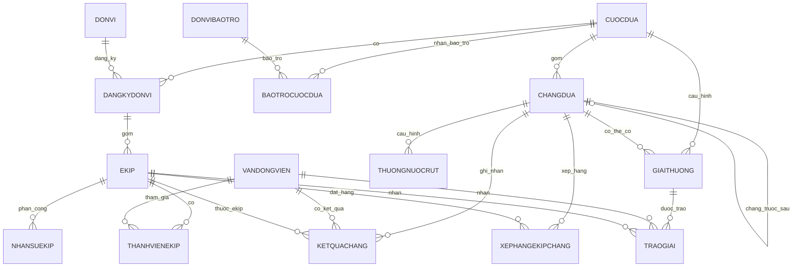

# Phan tich va thiet ke CSDL: Cuoc dua xe dap Cup truyen hinh TP.HCM

Tai lieu nay de xuat mo hinh du lieu cho he thong quan ly cuoc dua xe dap hang nam do HTV to chuc. Pham vi thiet ke bao gom dang ky don vi/ekip/van dong vien, nha bao tro, chang dua, ket qua chang, cach tinh thoi gian, xep hang va giai thuong.

## 1. Gia dinh va nguyen tac thiet ke

- Moi nam co mot `CuocDua`; cung mot he thong co the luu nhieu nam.
- Moi `DonVi` du thi co the dang ky tu 1 den 2 `Ekip` trong mot cuoc dua, vi du doi chinh va doi tre.
- Moi van dong vien chi thuoc mot va chi mot ekip trong mot cuoc dua.
- Moi ekip co dung 4 van dong vien, trong do dung 1 nguoi la truong ekip.
- Moi ekip co 1 huan luyen vien, 1 bac si, 1 tai xe, 1 xe phuc vu va 1 dien thoai lien lac.
- Moi chang co dung mot hinh thuc dua: `NUOC_RUT` hoac `TINH_GIO`.
- Cac bang ket qua va xep hang nen luu so giay de tinh toan chinh xac; khi hien thi moi doi ra gio/phut/giay.
- Giai thuong duoc mo hinh hoa rieng giua "dinh nghia giai thuong" va "lan trao giai" de ho tro giai co the co hoac khong duoc trao tuy dia phuong.

## 2. Nhom thuc the chinh

### 2.1. Thuc the to chuc

| Thuc the | Y nghia | Thuoc tinh tieu bieu |
| --- | --- | --- |
| `CuocDua` | Dot to chuc theo nam | `CuocDuaId`, `Nam`, `TenCuocDua`, `NgayBatDau`, `NgayKetThuc`, `DonViToChuc` |
| `DonVi` | Don vi dang ky du thi | `DonViId`, `TenDonVi`, `DiaChi`, `DienThoai`, `Email` |
| `DangKyDonVi` | Don vi tham gia mot cuoc dua | `DangKyDonViId`, `CuocDuaId`, `DonViId`, `NgayDangKy` |
| `Ekip` | Doi/ekip du thi trong mot cuoc dua | `EkipId`, `DangKyDonViId`, `TenEkip`, `LoaiEkip`, `SoDienThoaiLienLac`, `BienSoXePhucVu` |
| `NhanSuEkip` | HLV, bac si, tai xe cua ekip | `NhanSuId`, `EkipId`, `HoTen`, `NgaySinh`, `QuocTich`, `VaiTro` |

`LoaiEkip`: `CHINH`, `TRE`.

`VaiTro` trong `NhanSuEkip`: `HUAN_LUYEN_VIEN`, `BAC_SI`, `TAI_XE`.

### 2.2. Thuc the van dong vien

| Thuc the | Y nghia | Thuoc tinh tieu bieu |
| --- | --- | --- |
| `VanDongVien` | Ho so ca nhan VDV | `VanDongVienId`, `Ho`, `Ten`, `NgaySinh`, `QuocTich` |
| `ThanhVienEkip` | VDV thuoc ekip trong mot cuoc dua | `ThanhVienEkipId`, `EkipId`, `VanDongVienId`, `SoAo`, `LaTruongEkip` |

Ly do tach `VanDongVien` va `ThanhVienEkip`: mot VDV co the tham gia cac nam khac nhau, nhung moi nam/cuoc dua chi duoc gan vao mot ekip.

### 2.3. Thuc the bao tro va giai thuong

| Thuc the | Y nghia | Thuoc tinh tieu bieu |
| --- | --- | --- |
| `DonViBaoTro` | Don vi tai tro/bao tro | `BaoTroId`, `TenBaoTro`, `DiaChi`, `DienThoai`, `Email` |
| `BaoTroCuocDua` | Don vi bao tro cho mot cuoc dua | `BaoTroCuocDuaId`, `CuocDuaId`, `BaoTroId`, `MucHoTro`, `QuyenLoiQuangCao` |
| `GiaiThuong` | Cau hinh/dinh nghia giai thuong | `GiaiThuongId`, `CuocDuaId`, `ChangId`, `TenGiaiThuong`, `DoiTuong`, `PhamVi`, `NguonCap`, `LoaiGiaTri`, `TriGia`, `MoTaHienVat` |
| `TraoGiai` | Lan trao giai cho VDV hoac ekip | `TraoGiaiId`, `GiaiThuongId`, `VanDongVienId`, `EkipId`, `Hang`, `NgayTrao`, `GhiChu` |

`DoiTuong`: `CA_NHAN`, `EKIP`.

`PhamVi`: `CHANG`, `TOAN_CUOC`.

`NguonCap`: `BAN_TO_CHUC`, `DIA_PHUONG`, `BAO_TRO`, `KHAC`.

`LoaiGiaTri`: `TIEN`, `HIEN_VAT`.

Voi giai thuong cho chang, `ChangId` bat buoc co gia tri. Voi giai toan cuoc, `ChangId` de trong.

### 2.4. Thuc the chang dua

| Thuc the | Y nghia | Thuoc tinh tieu bieu |
| --- | --- | --- |
| `ChangDua` | Thong tin mot chang | `ChangId`, `CuocDuaId`, `ThuTu`, `ChangTruocId`, `ChangSauId`, `TenChang`, `DiemXuatPhat`, `DiemDich`, `DiaPhuongDich`, `SoKm`, `HinhThuc`, `ThoiGianToiDaGiay`, `DiaDiemTiepTe` |
| `ThuongNuocRut` | Thoi gian thuong cho top 3 chang nuoc rut | `ThuongNuocRutId`, `ChangId`, `Hang`, `SoGiayThuong` |
| `KetQuaChang` | Ket qua cua tung VDV tren tung chang | `KetQuaChangId`, `ChangId`, `VanDongVienId`, `EkipId`, `ThuHangDich`, `ThoiGianThucTeGiay`, `TrangThaiHoanTat`, `SoGiayPhat`, `SoGiayThuong`, `ThoiGianTinhGiay` |
| `XepHangEkipChang` | Ket qua/xep hang ekip theo chang | `XepHangEkipChangId`, `ChangId`, `EkipId`, `TongThoiGianGiay`, `ThuHang` |

`HinhThuc`: `NUOC_RUT`, `TINH_GIO`.

`TrangThaiHoanTat`: `HOAN_TAT`, `QUA_GIO`, `KHONG_HOAN_TAT`.

`ThoiGianTinhGiay = ThoiGianThucTeGiay + SoGiayPhat - SoGiayThuong`.

## 3. So do ERD logic



## 4. Luoc do quan he de xuat

### 4.1. Cuoc dua, don vi, ekip

```sql
CUOCDUA(
    CuocDuaId PK,
    Nam UNIQUE,
    TenCuocDua,
    NgayBatDau,
    NgayKetThuc,
    DonViToChuc
)

DONVI(
    DonViId PK,
    TenDonVi,
    DiaChi,
    DienThoai,
    Email
)

DANGKYDONVI(
    DangKyDonViId PK,
    CuocDuaId FK -> CUOCDUA,
    DonViId FK -> DONVI,
    NgayDangKy,
    UNIQUE(CuocDuaId, DonViId)
)

EKIP(
    EkipId PK,
    DangKyDonViId FK -> DANGKYDONVI,
    TenEkip,
    LoaiEkip CHECK IN ('CHINH', 'TRE'),
    SoDienThoaiLienLac,
    BienSoXePhucVu,
    UNIQUE(DangKyDonViId, LoaiEkip)
)
```

Rang buoc "moi don vi dang ky tu 1 den 2 ekip" duoc kiem soat bang:

- `UNIQUE(DangKyDonViId, LoaiEkip)` de khong co 2 doi chinh hoac 2 doi tre.
- Trigger hoac validation nghiep vu khong cho vuot qua 2 ekip trong cung `DangKyDonViId`.
- Bao cao kiem tra cuoi han dang ky de dam bao moi `DangKyDonVi` co it nhat 1 ekip.

### 4.2. Van dong vien va nhan su

```sql
VANDONGVIEN(
    VanDongVienId PK,
    Ho,
    Ten,
    NgaySinh,
    QuocTich
)

THANHVIENEKIP(
    ThanhVienEkipId PK,
    EkipId FK -> EKIP,
    VanDongVienId FK -> VANDONGVIEN,
    SoAo,
    LaTruongEkip BOOLEAN,
    UNIQUE(EkipId, VanDongVienId),
    UNIQUE(EkipId, SoAo)
)

NHANSUEKIP(
    NhanSuId PK,
    EkipId FK -> EKIP,
    HoTen,
    NgaySinh,
    QuocTich,
    VaiTro CHECK IN ('HUAN_LUYEN_VIEN', 'BAC_SI', 'TAI_XE'),
    UNIQUE(EkipId, VaiTro)
)
```

Rang buoc quan trong:

- Dung 4 VDV/ekip: trigger hoac validation nghiep vu dem so dong `THANHVIENEKIP` theo `EkipId`.
- Dung 1 truong ekip/ekip: partial unique index `UNIQUE(EkipId) WHERE LaTruongEkip = TRUE`.
- Mot VDV chi thuoc mot ekip trong mot cuoc dua: tao unique theo cap `(CuocDuaId, VanDongVienId)` thong qua trigger/view join `EKIP -> DANGKYDONVI`.
- Dung 1 HLV, 1 bac si, 1 tai xe/ekip: `UNIQUE(EkipId, VaiTro)`.

### 4.3. Chang dua va ket qua

```sql
CHANGDUA(
    ChangId PK,
    CuocDuaId FK -> CUOCDUA,
    ThuTu,
    ChangTruocId FK -> CHANGDUA NULL,
    ChangSauId FK -> CHANGDUA NULL,
    TenChang,
    DiemXuatPhat,
    DiemDich,
    DiaPhuongDich,
    SoKm,
    HinhThuc CHECK IN ('NUOC_RUT', 'TINH_GIO'),
    ThoiGianToiDaGiay NULL,
    DiaDiemTiepTe NULL,
    UNIQUE(CuocDuaId, ThuTu)
)

THUONGNUOCRUT(
    ThuongNuocRutId PK,
    ChangId FK -> CHANGDUA,
    Hang CHECK BETWEEN 1 AND 3,
    SoGiayThuong,
    UNIQUE(ChangId, Hang)
)

KETQUACHANG(
    KetQuaChangId PK,
    ChangId FK -> CHANGDUA,
    VanDongVienId FK -> VANDONGVIEN,
    EkipId FK -> EKIP,
    ThuHangDich NULL,
    ThoiGianThucTeGiay NULL,
    TrangThaiHoanTat CHECK IN ('HOAN_TAT', 'QUA_GIO', 'KHONG_HOAN_TAT'),
    SoGiayPhat DEFAULT 0,
    SoGiayThuong DEFAULT 0,
    ThoiGianTinhGiay,
    UNIQUE(ChangId, VanDongVienId),
    UNIQUE(ChangId, ThuHangDich)
)

XEPHANGEKIPCHANG(
    XepHangEkipChangId PK,
    ChangId FK -> CHANGDUA,
    EkipId FK -> EKIP,
    TongThoiGianGiay,
    ThuHang,
    UNIQUE(ChangId, EkipId),
    UNIQUE(ChangId, ThuHang)
)
```

Rang buoc theo loai chang:

- Neu `HinhThuc = 'TINH_GIO'` thi `ThoiGianToiDaGiay` bat buoc co gia tri va khong can dong `THUONGNUOCRUT`.
- Neu `HinhThuc = 'NUOC_RUT'` thi `ThoiGianToiDaGiay` de trong va can cau hinh toi da 3 dong thuong trong `THUONGNUOCRUT`.
- `EkipId` trong `KETQUACHANG` nen duoc lay tu `THANHVIENEKIP` tai cuoc dua do, khong nhap tay tuy y.

### 4.4. Bao tro va giai thuong

```sql
DONVIBAOTRO(
    BaoTroId PK,
    TenBaoTro,
    DiaChi,
    DienThoai,
    Email
)

BAOTROCUOCDUA(
    BaoTroCuocDuaId PK,
    CuocDuaId FK -> CUOCDUA,
    BaoTroId FK -> DONVIBAOTRO,
    MucHoTro,
    QuyenLoiQuangCao,
    UNIQUE(CuocDuaId, BaoTroId)
)

GIAITHUONG(
    GiaiThuongId PK,
    CuocDuaId FK -> CUOCDUA,
    ChangId FK -> CHANGDUA NULL,
    TenGiaiThuong,
    DoiTuong CHECK IN ('CA_NHAN', 'EKIP'),
    PhamVi CHECK IN ('CHANG', 'TOAN_CUOC'),
    NguonCap CHECK IN ('BAN_TO_CHUC', 'DIA_PHUONG', 'BAO_TRO', 'KHAC'),
    BaoTroId FK -> DONVIBAOTRO NULL,
    LoaiGiaTri CHECK IN ('TIEN', 'HIEN_VAT'),
    TriGia,
    MoTaHienVat NULL
)

TRAOGIAI(
    TraoGiaiId PK,
    GiaiThuongId FK -> GIAITHUONG,
    VanDongVienId FK -> VANDONGVIEN NULL,
    EkipId FK -> EKIP NULL,
    Hang,
    NgayTrao,
    GhiChu
)
```

Rang buoc:

- `DoiTuong = 'CA_NHAN'`: `VanDongVienId` bat buoc co, `EkipId` phai null.
- `DoiTuong = 'EKIP'`: `EkipId` bat buoc co, `VanDongVienId` phai null.
- `NguonCap = 'BAO_TRO'`: nen co `BaoTroId`.
- `LoaiGiaTri = 'HIEN_VAT'`: nen co `MoTaHienVat`.
- Giai dia phuong theo chang co the khong duoc tao/trao neu dia phuong khong cap giai.

## 5. Quy tac tinh ket qua

### 5.1. Ket qua chang tinh gio

Voi chang co `HinhThuc = 'TINH_GIO'`:

```text
Neu VDV hoan tat trong thoi gian toi da:
    SoGiayPhat = 0

Neu VDV ve dich sau thoi gian toi da:
    SoGiayPhat = 2 * (ThoiGianThucTeGiay - ThoiGianToiDaGiay)

Neu VDV khong hoan tat chang:
    SoGiayPhat = SoGiayPhatNguoiVeCuoiCung + 600
```

Trong do `NguoiVeCuoiCung` la VDV co `ThoiGianThucTeGiay` lon nhat trong nhom co ve dich. Neu chang khong co ai ve dich, ban to chuc can nhap muc phat mac dinh cho chang.

Thoi gian tinh cho bang tong:

```text
ThoiGianTinhGiay = ThoiGianThucTeGiay + SoGiayPhat
```

Voi VDV khong hoan tat, nen luu them `ThoiGianThucTeGiay` bang thoi gian cua nguoi ve cuoi hoac mot moc thoi gian quy doi do ban to chuc phe duyet, de dam bao tong thoi gian co the tinh duoc.

### 5.2. Ket qua chang nuoc rut

Voi chang co `HinhThuc = 'NUOC_RUT'`, ba VDV dau tien duoc tru thoi gian theo bang `THUONGNUOCRUT`.

```text
SoGiayThuong = SoGiayThuong ung voi ThuHangDich 1, 2 hoac 3
ThoiGianTinhGiay = ThoiGianThucTeGiay - SoGiayThuong
```

VDV ve dich dau tien trong moi chang duoc ghi nhan la nguoi mac ao xanh cua chang do. Co the truy van bang dieu kien:

```sql
SELECT *
FROM KETQUACHANG
WHERE ChangId = :changId AND ThuHangDich = 1;
```

### 5.3. Xep hang ca nhan toan cuoc

Tong thoi gian ca nhan:

```sql
SELECT
    kq.VanDongVienId,
    SUM(kq.ThoiGianTinhGiay) AS TongThoiGianGiay
FROM KETQUACHANG kq
JOIN CHANGDUA c ON c.ChangId = kq.ChangId
WHERE c.CuocDuaId = :cuocDuaId
GROUP BY kq.VanDongVienId
ORDER BY TongThoiGianGiay ASC;
```

- Hang 1 toan cuoc mac ao vang chung cuoc.
- Hang 1, 2, 3 ca nhan nhan giai thuong cua Ban To chuc.

### 5.4. Xep hang ekip

Tong thoi gian ekip trong mot chang:

```sql
SELECT
    ChangId,
    EkipId,
    SUM(ThoiGianTinhGiay) AS TongThoiGianGiay
FROM KETQUACHANG
GROUP BY ChangId, EkipId
ORDER BY ChangId, TongThoiGianGiay ASC;
```

Tong thoi gian ekip toan cuoc:

```sql
SELECT
    kq.EkipId,
    SUM(kq.ThoiGianTinhGiay) AS TongThoiGianGiay
FROM KETQUACHANG kq
JOIN CHANGDUA c ON c.ChangId = kq.ChangId
WHERE c.CuocDuaId = :cuocDuaId
GROUP BY kq.EkipId
ORDER BY TongThoiGianGiay ASC;
```

- Ekip hang 1, 2, 3 theo chang co the nhan giai dia phuong neu dia phuong co cap giai.
- Ekip hang 1, 2, 3 toan cuoc nhan giai thuong cua Ban To chuc.

### 5.5. Giai dia phuong theo chang

Neu dia phuong tai `DiemDich` co cap giai, ban to chuc tao cac dong `GIAITHUONG` voi:

- `PhamVi = 'CHANG'`
- `NguonCap = 'DIA_PHUONG'`
- `ChangId` la chang tuong ung
- `DoiTuong = 'CA_NHAN'` cho cac hang 1 den 10
- `DoiTuong = 'EKIP'` cho cac hang 1 den 3

Nguoi nhan giai ca nhan theo chang:

```sql
SELECT VanDongVienId, EkipId, ThuHangDich
FROM KETQUACHANG
WHERE ChangId = :changId
  AND ThuHangDich BETWEEN 1 AND 10
ORDER BY ThuHangDich;
```

Ekip nhan giai theo chang:

```sql
SELECT EkipId, ThuHang
FROM XEPHANGEKIPCHANG
WHERE ChangId = :changId
  AND ThuHang BETWEEN 1 AND 3
ORDER BY ThuHang;
```

## 6. Thong so ky thuat theo chang

Cac thong so co the tinh tu bang ket qua:

### 6.1. Danh sach van dong vien cua chang

```sql
SELECT v.*
FROM KETQUACHANG kq
JOIN VANDONGVIEN v ON v.VanDongVienId = kq.VanDongVienId
WHERE kq.ChangId = :changId
ORDER BY kq.ThuHangDich;
```

### 6.2. Ekip dan dau chang

```sql
SELECT *
FROM XEPHANGEKIPCHANG
WHERE ChangId = :changId AND ThuHang = 1;
```

Neu khong luu bang `XEPHANGEKIPCHANG`, co the tinh truc tiep bang tong `ThoiGianTinhGiay` theo `EkipId`.

### 6.3. Toc do trung binh

```text
TocDoTrungBinhKmH = SoKm / (AVG(ThoiGianThucTeGiay cua VDV hoan tat) / 3600)
```

Neu ban to chuc muon thong so theo nguoi thang chang, thay `AVG` bang thoi gian cua VDV `ThuHangDich = 1`.

### 6.4. Ty le VDV ve truoc thoi gian quy dinh

Chi ap dung truc tiep cho chang tinh gio:

```text
TyLe = So VDV co ThoiGianThucTeGiay <= ThoiGianToiDaGiay / Tong so VDV xuat phat
```

## 7. Cac rang buoc nghiep vu nen cai dat

1. `CUOCDUA.Nam` duy nhat.
2. Moi don vi trong mot cuoc dua co toi thieu 1 va toi da 2 ekip.
3. Trong mot don vi/cuoc dua, moi loai ekip chi xuat hien mot lan.
4. Moi ekip co dung 4 VDV.
5. Moi ekip co dung 1 truong ekip.
6. Moi VDV chi thuoc mot ekip trong cung mot cuoc dua.
7. Moi ekip co dung 1 HLV, 1 bac si, 1 tai xe.
8. Moi chang co `ThuTu` duy nhat trong mot cuoc dua.
9. `ChangTruocId` va `ChangSauId` phai cung `CuocDuaId` voi chang hien tai.
10. Chang tinh gio phai co `ThoiGianToiDaGiay`; chang nuoc rut khong can truong nay.
11. Chang nuoc rut chi co toi da 3 muc thuong cho hang 1, 2, 3.
12. Moi VDV chi co mot ket qua trong mot chang.
13. Trong mot chang, mot thu hang ve dich chi gan cho mot VDV.
14. Giai ca nhan chi trao cho VDV; giai ekip chi trao cho ekip.
15. Giai chang phai gan `ChangId`; giai toan cuoc khong gan `ChangId`.

## 8. Goi y cac view phuc vu bao cao

### 8.1. View bang tong thoi gian ca nhan

```sql
CREATE VIEW V_BangTongCaNhan AS
SELECT
    c.CuocDuaId,
    kq.VanDongVienId,
    SUM(kq.ThoiGianTinhGiay) AS TongThoiGianGiay
FROM KETQUACHANG kq
JOIN CHANGDUA c ON c.ChangId = kq.ChangId
GROUP BY c.CuocDuaId, kq.VanDongVienId;
```

### 8.2. View bang tong thoi gian ekip

```sql
CREATE VIEW V_BangTongEkip AS
SELECT
    c.CuocDuaId,
    kq.EkipId,
    SUM(kq.ThoiGianTinhGiay) AS TongThoiGianGiay
FROM KETQUACHANG kq
JOIN CHANGDUA c ON c.ChangId = kq.ChangId
GROUP BY c.CuocDuaId, kq.EkipId;
```

### 8.3. View ao xanh tung chang

```sql
CREATE VIEW V_AoXanhChang AS
SELECT
    kq.ChangId,
    kq.VanDongVienId,
    kq.EkipId
FROM KETQUACHANG kq
WHERE kq.ThuHangDich = 1;
```

### 8.4. View ao vang chung cuoc

```sql
CREATE VIEW V_AoVangChungCuoc AS
SELECT *
FROM (
    SELECT
        btc.*,
        RANK() OVER (
            PARTITION BY btc.CuocDuaId
            ORDER BY btc.TongThoiGianGiay ASC
        ) AS ThuHang
    FROM V_BangTongCaNhan btc
) x
WHERE x.ThuHang = 1;
```

## 9. Mo hinh chuan hoa tom tat

Thiet ke dat muc 3NF o cac diem chinh:

- Thong tin ca nhan VDV chi luu mot lan trong `VANDONGVIEN`.
- Quan he VDV - ekip theo tung cuoc dua duoc tach qua `THANHVIENEKIP`.
- Don vi bao tro va lan bao tro theo nam duoc tach qua `DONVIBAOTRO` va `BAOTROCUOCDUA`.
- Giai thuong va nguoi/ekip duoc trao giai duoc tach qua `GIAITHUONG` va `TRAOGIAI`.
- Ket qua tung chang la bang nghiep vu trung tam, tu do tinh ao xanh, ao vang, xep hang ca nhan, xep hang ekip va cac thong so ky thuat.
